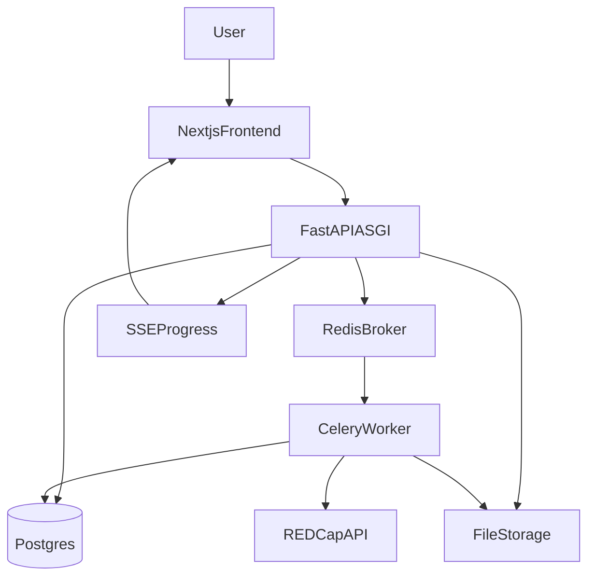

# REDCap Batch Locking Web App — Implementation Plan

Living architecture and delivery plan for this repository. Update this file as decisions change.

## Phase 1 — Discovery & explicit assumptions

### Product summary

- Internal, authenticated web application that lets users submit CSV-driven **lock/unlock jobs** against one or more REDCap projects, executes jobs safely (live for small jobs; background for large jobs), and produces **downloadable reports** with a full **audit trail**.

### Assumptions (clearly labeled)

- **Hosting** (confirmed): On your own server (Linux VM(s) or bare metal) with Docker/Compose; no reliance on managed cloud services.
- **REDCap tokens** (confirmed): **Never stored**; token is supplied per job and only kept in-memory for job execution.
- **REDCap API URL**: The REDCap API/base URL may be stored for host-level throttling, job auditability, and project history.
- **Users**: Created only by Admin/Super Admin; no public sign-up.
- **Projects**: Multiple REDCap projects over time; the system must key mappings to a stable project identifier (see below).
- **Project identifier**: Since tokens aren’t stored, we will identify a “project” by calling REDCap `exportProjectInfo` (or equivalent) at job preflight and storing **project_id** (and optionally project title) returned by REDCap.
- **Uploads**: CSV and optional “unresolved queries export” are small enough for standard upload limits (configurable), but jobs may be large (10k+ rows).
- **Compliance**: Data may be sensitive; design assumes least-privilege, encryption at rest, and strong audit logging.
- **Project root** (confirmed): All code, Docker, and docs for this product live in **this repository** (e.g. `/Users/mujtaba/Documents/Oxford University/Development 2026/REDCap Batch Looking Webapp` on the author’s machine). Treat the repo root as canonical.

### Query export findings from sample file

- **Unresolved queries input format** (confirmed from sample): v1 will support the REDCap Data Resolution Dashboard export as **CSV**.
- **CSV parsing rule**: Parse query files with a standards-compliant CSV parser that respects quoted cells, embedded commas, and CRLF line endings. Do **not** parse by splitting on commas.
- **Field column rule**: In the query export `Field` column, the **first token** is the REDCap **field name / variable name** and the remaining text is the human-readable **field label**. Matching to REDCap metadata must use the extracted field name, not the label text.
- **Extensibility**: Keep the unresolved-queries parser behind an adapter interface so additional CSV variants or future XLSX exports can be added without changing the locking engine.

## Phase 2 — Technical architecture (opinionated)

### Recommended stack (on-prem friendly, production-grade)

- **Backend**: Python **FastAPI** (ASGI on **Uvicorn**)
  - **Why**: Clear API layer, first-class **OpenAPI** for QA, good fit for I/O-bound REDCap calls and **SSE** progress; keep the **job engine** as importable services used by both API and Celery workers.
  - **Pairing**: **SQLAlchemy 2.0** + **Alembic** (same “models + migrations” discipline as Django, without Django’s built-in admin/auth).
- **Async jobs**: **Celery** workers + **Redis** broker
  - Why: reliable background processing, retries, scheduling; FastAPI does **not** replace a queue for long jobs.
- **DB**: **PostgreSQL**
  - Why: strong relational model for jobs/rows/audits/mappings, good indexing/partitioning options.
- **Realtime progress**: **Server-Sent Events (SSE)** via Starlette/FastAPI; optional WebSockets later
  - Why: fits ASGI natively; no separate channels stack required for SSE.
- **Frontend**: **Next.js (React, TypeScript)** + Tailwind
  - Why: strong UX for multi-step job wizard + mapping confirmation; easy to build dashboards.
- **Object/file storage**: Local disk with strict permissions **or** S3-compatible (e.g., MinIO) on-prem
  - Why: keeps options open; implement behind a storage interface.
- **Auth / 2FA**: **HTTP-only cookie + server-side sessions** (Redis or DB); **TOTP** for Admin/Super Admin (`pyotp` or similar). **JWT** optional later for non-browser API clients.

### FastAPI vs Django (tradeoffs)

| Area         | Django + DRF                           | FastAPI + SQLAlchemy                                 |
| ------------ | -------------------------------------- | ---------------------------------------------------- |
| Auth & admin | User model, sessions, **Django Admin** | Implement RBAC + user CRUD; **admin UIs in Next.js** |
| Migrations   | `migrate`                              | **Alembic**                                          |
| API shape    | DRF serializers                        | **Pydantic** (strong for CSV/mapping DTOs)           |
| Async        | Heavier story                          | **async routes** + `httpx` for REDCap optional       |

**Verdict**: FastAPI fits this product if you want explicit services + great typing/OpenAPI and accept **building admin screens in the frontend**. Choose Django if **Django Admin** and minimal custom auth matter more than the above.

### High-level architecture

- Next.js frontend talks to **FastAPI** (REST + SSE).
- FastAPI validates uploads, stores job + rows, runs **preflight** (CSV schema, REDCap connectivity, metadata fetch, instrument field detection).
- User confirms per-instrument field mapping (or reuses saved mapping).
- Job is executed either:
  - **Live** (sync-ish): still executed via Celery but with tight polling/streaming updates to UI.
  - **Background**: Celery worker processes in chunks; UI polls/SSE for progress.

### Queue/background processing approach

- Celery task per job; inside task, process rows in **chunks** (e.g., 50–200 rows per chunk) with row-level transactions.
- Persist progress in DB + publish lightweight events for UI.

### Rate limiting / throttling design (REDCap-safe)

- Implement a shared “REDCap client” wrapper with:
  - **Token-bucket limiter** (configurable calls/min).
  - **Backoff & wait windows** on HTTP 429 / REDCap rate-limit errors.
  - Persistent job state: job can enter `waiting_due_to_rate_limit` and resume.
- Rate limits configurable globally and overrideable per REDCap host.

### File storage design

- Do **not** persist uploaded request CSV or optional queries file after parsing/import unless a future compliance or debugging requirement explicitly needs it.
- Persist the normalized job rows and execution results in the database instead of keeping raw input files.
- Generate report artifacts (CSV; later XLSX) and store them with retention policies.
- Store only what’s needed; avoid storing raw REDCap payloads.

### Auth + RBAC design

- Cookie-based sessions issued by FastAPI; session id in **HTTP-only** cookie; session payload in Redis or Postgres.
- Roles (same as before):
  - **SuperAdmin**: system-level settings, create admins, view everything.
  - **Admin**: manage standard users, view most operational data.
  - **User**: own jobs/reports.
- Enforce via **dependencies** (`Depends(get_current_user)`, role checks) on every route + **object-level** checks (job.owner_id, etc.).
- 2FA required for Admin/SuperAdmin (configurable), optional for Users.

## Phase 3 — PRD (what we will write)

Deliverable: `docs/PRD.md`

- Goals, non-goals
- Personas/roles
- Workflows (job creation wizard, mapping confirmation, execution monitoring, report download, admin management)
- Functional requirements (auth, jobs, mapping, throttling, reports, dashboards, audit)
- Non-functional requirements (security, performance, availability, observability, retention)
- Acceptance criteria per feature

## Phase 4 — Data model (what we will design)

Deliverables: `backend/app/models/`, `backend/alembic/`, `backend/alembic/versions/20260406_0001_phase_4_core_schema.py`

We will define tables and key indexes for:

- `users`, `roles`, `permissions` (or role enum + join tables)
- `redcap_hosts` (canonical REDCap API/base URL per host + per-host throttling settings)
- `jobs` (owner, status, thresholds, options, REDCap API URL/host reference, project metadata)
- `job_rows` (input row + normalized fields)
- `row_results` (status, message, timings, retries)
- `instrument_mappings` (project_id + instrument scoped; status var/date var; coded values; last validated; drift detection)
- `reports` (artifact metadata)
- `audit_events` (actor, action, object, metadata, IP/user-agent)
- `job_events` (status changes, rate-limit waits, retries)
- `system_settings` (thresholds, retention, 2FA policy)

Sensitive fields:

- **REDCap token**: not stored.
- Encrypt at rest: app secret key, DB credentials, session signing secret; optional per-host credentials if ever added later.

## Phase 5 — API/backend design (what we will specify)

- **Modules/services** (FastAPI layout): `api/` (routers), `core/` (config, security, deps), `db/` (session, base models), `models/`, `schemas/` (Pydantic), `services/` (redcap client, mapping detection, job engine), `workers/` (Celery tasks).
- REST endpoints for:
  - Auth/session, password reset, 2FA setup/verification
  - Users/admin management
  - Job create (multipart upload), CSV validate, metadata preflight
  - Mapping confirm/update/reuse
  - Job start/cancel
  - Job status + progress stream (SSE)
  - Report download
  - Audit log query
  - Settings (SuperAdmin)
- Job execution contract:
  - Deterministic row processing, idempotency keys, duplicate upload detection
  - Retry policy for transient REDCap/API errors
  - Cancellation checkpoints between chunks

## Phase 6 — Frontend/UI design (what we will design)

Screens:

- Login, password reset, optional 2FA challenge
- User dashboard (own jobs, quick actions)
- Admin dashboard (system view, metrics)
- Create job wizard:
  - Upload + job options
  - CSV validation results
  - Metadata discovery + mapping confirmation (per instrument)
  - Start execution
- Job detail:
  - Live progress, per-row results table, filters
  - Event timeline (rate-limit waits, retries)
- Reports page (download)
- Admin user management
- Audit log viewer
- System settings (SuperAdmin)

## Phase 7 — Processing engine design (detailed, safety-first)

- Preflight pipeline:
  - Parse CSV, normalize fields (record, instance, instrument, arm, action)
  - Validate instrument names, required columns, allowed actions
  - REDCap connectivity test (token + url)
  - Fetch metadata/codebook
  - If unresolved queries file supplied:
    - parse with a real CSV parser that preserves quoted commas and multiline text
    - extract REDCap field name from the `Field` column using the first token only
    - normalize query status and record/instance identifiers for later row checks
  - Detect for each instrument:
    - form complete field
    - candidate CRF status fields
    - candidate lock date fields
    - score candidates using:
      - label match, variable name match
      - proximity to `*_complete`
      - type validation (radio/dropdown/text date)
    - produce confidence: high / confirm / not found
  - If mapping missing/low confidence: block start until user confirms.
- Lock workflow per row:
  - get lock status
  - if locked: ignored
  - else check form complete
  - if not complete: ignored
  - else optional unresolved query check (configurable rule):
    - find queries for the same record / event / instance context
    - treat any query whose status is not `CLOSED` as unresolved
    - map query field names to REDCap forms via metadata
    - if any unresolved query belongs to the form being locked, block locking for that row
  - write CRF status + lock date in correct REDCap formats (based on metadata)
  - call lock endpoint
  - persist row result
- Unlock workflow per row:
  - get lock status
  - if unlocked: ignored
  - else unlock
  - if success: clear/reset CRF status + lock date per mapping config
  - persist row result
- Throttling:
  - shared limiter, job enters waiting state, resumes
- Chunking:
  - process in chunks; update progress; allow cancel between chunks

## Phase 8 — Security & compliance

- Secure cookies, CSRF, session rotation, bcrypt/argon2 hashing
- Admin/SuperAdmin 2FA
- Strict RBAC + object-level authorization
- Upload validation (content-type, size, CSV parsing hardening)
- Secrets management and server hardening guidance
- Audit immutability (append-only audit events)

## Phase 9 — Senior recommendations (beyond requirements)

- Dry-run mode (no writes)
- “Test connection” and “Fetch metadata” buttons
- Mapping health check + drift alerts
- Job retry/re-run from failed rows
- Report retention and purge jobs
- Duplicate submission detection (hash of CSV + options)
- Observability: structured logs, metrics, worker dashboards
- Resumable jobs (checkpointing)
- Per-project policy packs (unresolved queries rule, unlock reset behavior)

## Phase 10 — Phased build roadmap (with approvals)

- MVP: auth/RBAC, job upload, mapping confirmation, background processing, CSV report, audit basics
- Production v1: 2FA for admins, dashboards/metrics, XLSX reports, robust retries/rate limiting, drift detection, retention policies
- Enhancements: resumable jobs, notifications, more query formats, WebSockets, advanced analytics

## Phase 11 — Implementation scaffold (when we switch from planning to building)

Once you approve this plan, we will generate (under **this repo root**):

- Backend repo structure: **FastAPI** app (`main.py`, routers under `api/routers/`), **SQLAlchemy** models, **Alembic** env, services (`redcap`, `mapping`, `jobs`), **Celery** app + tasks
- Frontend repo structure: Next.js app with pages/components for the wizard and dashboards
- Docker Compose: `api` (Uvicorn), `worker`, `beat`, `postgres`, `redis`, optional `minio`
- Initial **Alembic** migrations for core tables
- Minimal endpoints: auth/session, job create, mapping confirm, job status, report download, SSE progress
- Worker task skeleton + pseudocode translated into real services

## Delivery checklist (from planning session)

| Item | Status |
|------|--------|
| PRD (Phase 3) full write-up | Completed |
| Architecture finalized (Phase 2) | In progress |
| Data model DDL + Alembic (Phase 4) | Completed |
| OpenAPI / REST contract (Phase 5) | In progress |
| Engine spec + detection scoring (Phase 7) | Pending |
| Security runbook (Phase 8) | Pending |
| MVP vs v1 scope sign-off (Phase 10) | Pending |
| Full scaffold beyond Hello World + Docker Phase A (Phase 11) | Pending |
